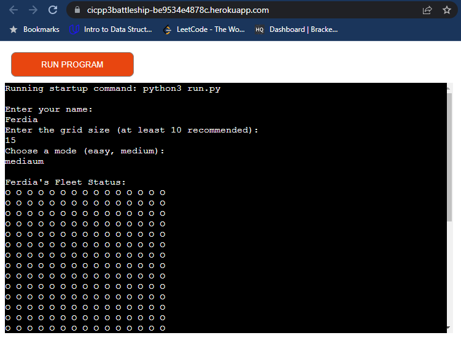
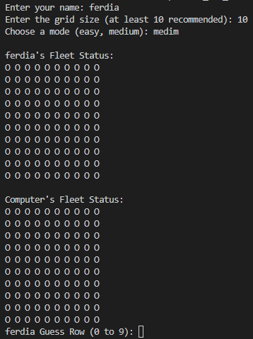

# Battleship

Battleship is a strategy logic and guessing game for two players. It is played on ruled grids on which each player's fleet of warships are marked.
(Developer: Ferdia Cahill)

[Live webpage](https://cicpp3battleship-be9534e4878c.herokuapp.com/)

## Table of Content

1. [Project Goals](#project-goals)
    1. [User Goals](#user-goals)
    2. [Site Owner Goals](#site-owner-goals)
2. [User Experience](#user-experience)
    1. [Target Audience](#target-audience)
    2. [User Requirements and Expectations](#user-requirements-and-expectations)
    3. [User Stories](#user-stories)
3. [Technical Design](#technical-design)
    1. [Flowchart](#flowchart)
4. [Technologies Used](#technologies-used)
    1. [Languages](#languages)
    2. [Frameworks & Tools](#frameworks-&-tools)
5. [Features](#features)
6. [Testing](#validation)
    1. [PEP8 validation](#pep8-validation)
    2. [Testing user stories](#testing-user-stories)
8. [Bugs](#Bugs)
9. [Deployment](#deployment)
10. [Credits](#credits)
11. [Acknowledgments](#acknowledgments)

### User Goals
1. The application user wants to play a logic game

### Site Owner Goals
1. The Battleships game is played on grids on which each player's fleet of battleships are marked. The locations of the fleets are concealed from the other player. Players call shots at the other player's ships, and the objective of the game is to destroy the opposing player's fleet.
2. The application provides a working battleships game for a single user to play against the computer

## User Experience
When starting the game you will receive some initial input requests.
1. Username
2. Size of grid you wish to play on (recommended 10)
3. Choose your difficulty easy or medium. This dies chang how the computer player chooses they next turn.

### Target Audience
Younger people between the ages of 13 and 30
### User Requirements and Expectations
You must input your guesses first by row them coloumn. You should expect to see feedback on hit and miss information on the grid as well as text feedback.

### Languages
- Python 3
- VS Code

### Frameworks & Tools
- Heroku
- pycodestyle: Used as a validation tool instead of pep8 online.
- gitHub
- Git

## Features
1. User defined grid sizes

2. Warn the user if their guess is off-grid

3. Hit and miss feedback

### Username Input
- Prompts a user to input a username

### Game Board
- Player and computer boards visible

### Game Inputs
- Allows the user to input their guesses and feedsback the result.
- Shows the computer's guess.

## Validation

### PEP8 validation
At the time of creation, the PEP8 online Python validation website was inoperative. To validate the code, a PEP8 validator that is built into the VS Code Workspace was used.

1. Open the extensions tab on the left hand side
2. Search for Python and install the mocrosoift approved version v2023.10.1
3. Features include linting 
4. PEP8 errors will now be underlined in red, as well as being listed in the PROBLEMS tab beside the terminal.

There were no errors or warnings flagged.

### Testing user stories

## Bugs

| **Bug** | **Fix** |
| A bug exists where the end of game sequence does not always happen. Usually no matter who has won a replay option is available. | No known fix as of yet |

## Deployment
Use the following steps to deploy the poject to Heroku: 
1. Login or create a Heroku account.
2. Click the "New" button in the upper right corner and select "Create New App".
3. Choose an app name and your region and click "Create App". Note: the app name must be unique.
4. Go to the "Settings" tab, add the python build pack and then the node.js build pack. This is to ensure the project functions correctly with the Code Institute pre-installed template.
5. Go to the "Deploy" tab and pick GitHub as a deployment method.
6. Search for a repository to connect to.
7. Click enable automatic deploys and then deploy branch.
8. Wait for the app to build and then click on the "View" link.

You can fork the repository by following these steps:
1. Go to the GitHub repository.
2. Click on the Fork button in the upper right-hand corner.

You can clone the repository by following these steps:
1. Go to the GitHub repository.
2. Locate the Code button above the list of files and click it.
3. Select if you prefer to clone using HTTPS, SSH, or Github CLI and click the copy button to copy the URL to your clipboard.
4. Open Git Bash.
5. Change the current working directory to the one where you want the cloned directory.
6. Type git clone and paste the URL from the clipboard ($ git clone https://github.com/YOUR-USERNAME/YOUR-REPOSITORY).
7. Press Enter to create your local clone.

## Credits
CS Students:
https://www.youtube.com/watch?v=MgJBgnsDcF0&t=376s&ab_channel=CSStudents

ArjanCodes
https://www.youtube.com/watch?v=fj2tuTIcUys&ab_channel=ArjanCodes

Python Ninja
https://www.youtube.com/watch?v=cwpS_ac8uk0&ab_channel=PythonNinja

### Code
- Code Institute Python lessons.

## Acknowledgments
